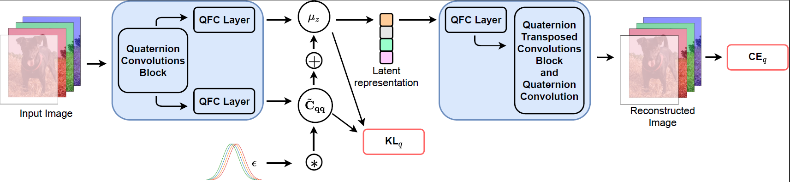

# QVAE
## A Quaternion-Valued Variational Autoencoder
Official Pytorch implementation of [A Quaternion-Valued Variational Autoencoder](https://arxiv.org/abs/2010.11647) (QVAE) accepted as conference paper at ICASSP 2021. 

Eleonora Grassucci, Danilo Comminiello, and Aurelio Uncini.

### Abstract
Deep probabilistic generative models have achieved incredible success in many fields of application. Among such models, variational autoencoders (VAEs) have proved their ability in modeling a generative process by learning a latent representation of the input. In this paper, we propose a novel VAE defined in the quaternion domain, which exploits the properties of quaternion algebra to improve performance while significantly reducing the number of parameters required by the network. The success of the proposed quaternion VAE with respect to traditional VAEs relies on the ability to leverage the internal relations between quaternion-valued input features and on the properties of second-order statistics which allow to define the latent variables in the augmented quaternion domain. In order to show the advantages due to such properties, we define a plain convolutional VAE in the quaternion domain and we evaluate it in comparison with its real-valued counterpart on the CelebA face dataset.

Architecture of the proposed QVAE.



### Training

To run QVAE training, download [CelebA dataset](http://mmlab.ie.cuhk.edu.hk/projects/CelebA.html), install `requirements.txt` and type:
```python
python train_qvae.py
```
Once trained the model, to generate new samples and reconstructions from the test set, type:
```python
python generation.py
```
specify `--QVAE=True` to generate from QVAE.

Quaternion convolutions are borrowed from [Pytorch-Quaternion-Neural-Networks](https://github.com/Orkis-Research/Pytorch-Quaternion-Neural-Networks) by Titouan Parcollet.


## An Information-Theoretic Perspective on Proper Quaternion Variational Autoencoders

Official Pytorch implementation of [An Information-Theoretic Perspective on Proper Quaternion Variational Autoencoders](https://www.mdpi.com/1099-4300/23/7/856), published on MDPI Entropy 23(7), July 2021.

### Abstract
Variational autoencoders are deep generative models that have recently received a great deal of attention due to their ability to model the latent distribution of any kind of input such as images and audio signals, among others. A novel variational autoncoder in the quaternion domain H, namely the QVAE, has been recently proposed, leveraging the augmented second order statics of H-proper signals. In this paper, we analyze the QVAE under an information-theoretic perspective, studying the ability of the H-proper model to approximate improper distributions as well as the built-in H-proper ones and the loss of entropy due to the improperness of the input signal. We conduct experiments on a substantial set of quaternion signals, for each of which the QVAE shows the ability of modelling the input distribution, while learning the improperness and increasing the entropy of the latent space. The proposed analysis will prove that proper QVAEs can be employed with a good approximation even when the quaternion input data are improper.


The code for this paper is contained in the folder `entropy`. Run the `main.py` which uses the proper and improper signals defined in `datasets.py`. The model is defined in the folder `models`.


### Cite

Plese cite our works if you found them useful:

Eleonora Grassucci, Danilo Comminiello, and Aurelio Uncini, "A Quaternion-Valued Variational Autoencoder", in <i>IEEE Int. Conf. on Acoust., Speech and Signal Process. (ICASSP)</i>, Toronto, Canada, Jun. 6-11, 2021.

```
@Conference{GrassucciICASSP2021,
  author =    {Grassucci, E. Comminiello, D. and Uncini, A.},
  title =     {A Quaternion-Valued Variational Autoencoder},
  booktitle = {IEEE Int. Conf. on Acoust., Speech and Signal Process. (ICASSP)},
  address = {Toronto, Canada},
  month = jun,
  year =      {2021},
}
```

Eleonora Grassucci, Danilo Comminiello, and Aurelio Uncini, "An Information-Theoretic Perspective on Proper Quaternion Variational Autoencoders", Entropy 23, no. 7: 856, 2021.
```
@Article{GrassucciEntropy2021,
author = {Grassucci, E. and Comminiello, D. and Uncini, A.},
title = {An Information-Theoretic Perspective on Proper Quaternion Variational Autoencoders},
journal = {Entropy},
volume = {23},
year = {2021},
number = {7},
article-number = {856}
}
```

#### Interested in Quaternion Generative Models?

Check also the Quaternion Generative Adversarial Network [[Paper](https://arxiv.org/pdf/2104.09630.pdf)] [[GitHub](https://github.com/eleGAN23/QGAN)].

